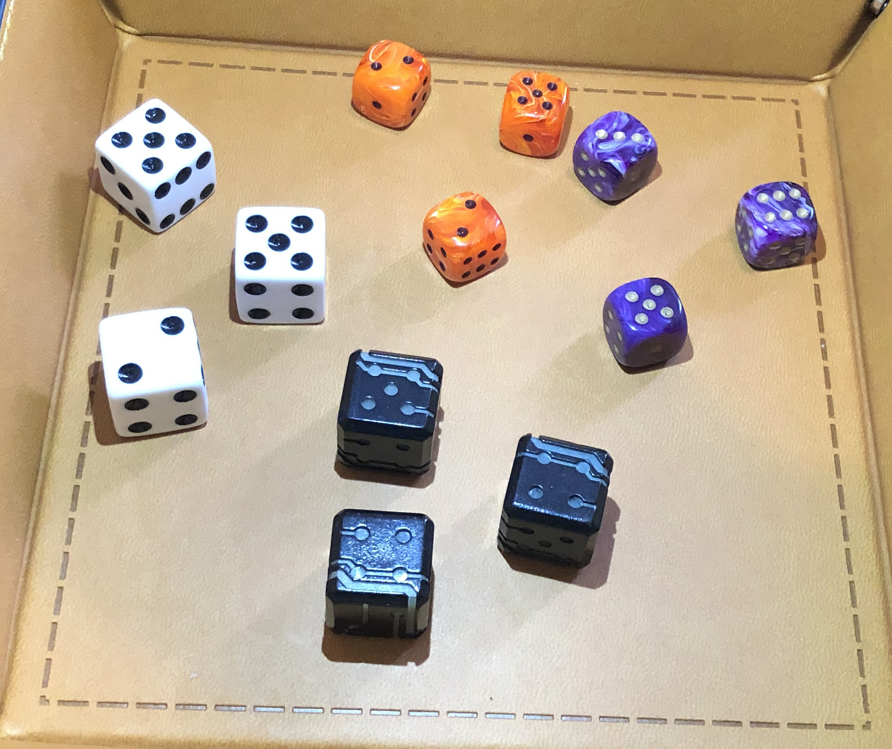

# Stock Testing Images

The images in this directory are intended to be used as test images for recognition.

They are standard JPEGs in every respect except that they have been imbued with an extra JPEG Record Block (Assignment: `0xFFED`, Symbol: <code>APP13</code>) which is encoded first with a marker to identify it then a C structure containing all of the expected values of top-facing Pips on the dice in the image. This data can be read or set by the CLI tool `CVDiceAnnotator` or programmatically via `LibCVDiceAnnotation` which are both outputs of the main project's CMake build process.

The images differ in complexity with the ultimate goal of being able to parse the value of the image:  
